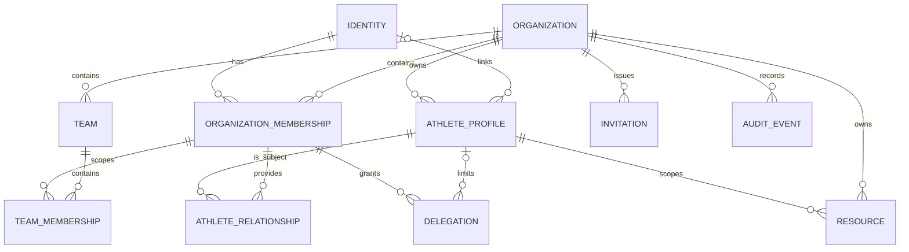

# Access Control Architecture

## Status and Scope

This is the normative target architecture for MyRidePlan access control. It is
a product and governance model, not an implementation, migration, or approval
of the current database policies.

L04 changes only this document. It does not change application code, Supabase
tables, policies, RPCs, data, authentication, user flows, or feature flags.
L05 and later lots must use this document as their decision baseline and must
turn its target rules into additive, reviewed implementation steps.

## Decision Summary

MyRidePlan will use **tenant-scoped RBAC plus relationship and delegation
constraints**:

1. An authenticated identity can belong to one or more organizations.
2. A role assignment belongs to an organization, never to the whole product
   data plane.
3. A role grants a bounded capability set; it never grants unrestricted access
   to every athlete in the organization.
4. Athlete access is constrained by an active coach-athlete relationship or an
   explicit, time-bounded delegation.
5. Resource rows carry an organization boundary and, where applicable, an
   athlete, author, owner, or team boundary.
6. The backend is the sole authorization decision point. RLS enforces row
   boundaries; RPCs enforce multi-row invariants and sensitive transitions.
7. The frontend receives a capability view for UX only. Hiding a control is
   never an authorization mechanism.

The model deliberately separates **identity**, **membership role**,
**relationship scope**, **delegation**, and **account state**. Collapsing them
into one `role` field would not support teams, transfers, specialist access, or
multiple organizations safely.

## Evidence and Current-State Audit

### Observed Roles and Assumptions

The current source has an application state shaped as either `coach` or
`athlete`.

| Current condition | Effective frontend role | Evidence | Risk |
| --- | --- | --- | --- |
| No authenticated session | No application access. | `src/app/page.tsx` calls `auth.getSession()`. | Authentication state is separate from authorization. |
| Authenticated user has an `athletes.user_id` row | `athlete`. | Session restoration and athlete login query `athletes` by `user_id`. | A data lookup becomes the role authority. |
| Authenticated user has no matching athlete row | `coach`. | Session restoration defaults to `setAuth({ role: "coach" })`. | Any non-athlete authenticated identity is treated as a coach. |
| Athlete row has `active = false` | Signed out as an archived athlete. | Session restoration and athlete login inspect `active`. | Archive is partially an account-access state and has no server-side model in the UI. |
| `user_roles` row | Not used by the application. | Remote `is_coach()` reads it; source does not. | Two incompatible sources of role truth exist. |
| `profiles.role` | Not used by the application. | Present in the L01 schema inventory only. | A third, unowned role representation exists. |

There is no current source implementation of platform owner, administrator,
assistant coach, specialist, support, multi-organization membership, scoped
delegation, suspension, or account disablement.

### Frontend Authorization Decisions

The frontend currently determines both presentation and many data operations
from `auth.role`, `activeId`, or selected group state. Examples include:

- `src/app/page.tsx`: session restoration assigns `coach` from absence of an
  athlete record; `isCoach` gates page availability and operations.
- `src/components/layout/Header.tsx`: navigation is selected entirely from the
  frontend role.
- `src/components/calendar/DayView.tsx` and `Session.tsx`: coach-only controls
  for group changes, session creation, update, and deletion are conditional
  renders.
- `src/components/athlete/ManagementPage.tsx`: athlete and group management is
  available through frontend props.
- `src/app/page.tsx`: athlete deletion, invitation linking, direct athlete-row
  updates, library changes, planning changes, and group operations are issued
  from the browser.
- `src/lib/api/groups.ts` and `src/lib/api/RroupCalendar.ts`: browser code
  performs group membership and cross-athlete deletion sequences.

These checks may improve usability, but they are not evidence of permission.
Every operation remains dependent on the remote authorization boundary.

### Current Remote Authorization Baseline

The L01 public-schema snapshot documents 19 tables, 49 policies, RLS enabled
on every exported table, and no relevant source-owned server layer. The
snapshot is a fact source, not a target design.

Critical observations from
`docs/supabase/remote-schema-reference.md` and the baseline dump include:

1. `athletes`, `calendar_workouts`, and `workout_feedbacks` have open `anon`
   policies with `USING (true)` and/or `WITH CHECK (true)`.
2. `workout_library` has broad public policies; `athlete_week_notes` has an
   unrestricted policy.
3. Group policies are named for coaches but use true predicates for every
   authenticated user.
4. Coach authorization is inconsistent: some policies use `is_coach()`, while
   others infer coach status from the absence of an athlete row.
5. `link_athlete_invite(uuid, text, uuid)` is a `SECURITY DEFINER` overload
   callable from the client flow; it is granted to `anon` and does not require
   an unlinked athlete in the captured definition.
6. `user_roles`, `profiles`, `week_colors`, and `workout_proposals` are not
   called by the current source, creating drift and ownership ambiguity.
7. Groups have no exported organization or ownership relation.

These conditions are critical security debt. They must not be copied into a
future model, but L04 does not change them.

### Current Functional Surface

The current application reads or writes athlete data, calendars, feedback,
library content, categories, proposals, weekly planning, notes, groups,
observations, goals, and tests. The existing broad coach view assumes a single
coach can operate on every loaded athlete. There is no reliable data-level
notion of organization, team, assignment, delegation, resource author, or
transfer history.

## Goals and Non-Goals

### Goals

- Support independent coaches, clubs, academies, professional teams,
  federations, and future organizations without redesigning authorization.
- Support an athlete with several active practitioners while retaining one
  clearly accountable primary coach when the organization chooses one.
- Support scoped, time-bounded access for assistant coaches and specialists.
- Preserve historical provenance during transfer, archive, restoration, and
  account recovery.
- Make every sensitive action auditable, server-authorized, and reversible
  where the domain permits it.
- Provide a stable permission vocabulary for web, mobile, API, AI, and future
  partner integrations.

### Non-Goals

- L04 does not choose exact SQL table names, columns, claims, JWT contents, or
  RLS syntax.
- L04 does not grant a global administrator unrestricted athlete-data access.
- L04 does not create a clinical record system. Medical data is an optional,
  separately governed future scope.
- L04 does not make a feature flag, React condition, or client environment
  value an authorization control.

## Actors, Roles, and States

### Kept Roles

| Role | Scope | Why it exists | Explicit boundary |
| --- | --- | --- | --- |
| `platform_owner` | Control plane | Owns platform governance, break-glass policy, and legal/operational responsibility. | Not a normal tenant-data role; no routine athlete-data access. |
| `platform_administrator` | Control plane | Operates tenants, billing, abuse response, and platform configuration. | Cannot browse athlete content without a separate audited support grant. |
| `platform_support` | Control plane | Resolves incidents through time-limited, consented support sessions. | No standing access to tenant data; every session is audited. |
| `organization_owner` | Organization | Owns a coach's personal workspace, club, academy, or team tenant and can govern its lifecycle. | Cannot bypass platform controls or other organizations. |
| `organization_administrator` | Organization | Manages membership, teams, invitations, and organization configuration. | Cannot invent clinical access or silently override relationship scope. |
| `coach` | Organization plus assigned athletes | Plans training and is accountable for an athlete relationship. | Access is limited to active assignments and delegated team scope. |
| `assistant_coach` | Organization plus delegated athletes/teams | Supports coaching without inheriting owner-level administration. | Cannot transfer athletes, manage organization governance, or obtain unbounded access by default. |
| `practitioner` | Organization plus explicit discipline and athlete scope | Covers a performance specialist, nutritionist, or medical practitioner without multiplying broad roles. | Access is limited to domain-specific capabilities, explicit consent where needed, and assigned athletes. |
| `athlete` | Own organization athlete profile | Views and contributes to their own training experience. | Cannot access other athletes, organization governance, or coach-only private notes. |

### Studied but Not Kept as Separate Roles

- **Super administrator**: not retained as a daily role. Its legitimate
  operational cases are split between `platform_owner`,
  `platform_administrator`, and audited break-glass procedure. A permanent
  omnipotent role would be a severe SaaS risk.
- **Generic administrator**: split into `platform_administrator` and
  `organization_administrator`, because their trust boundaries differ.
- **Preparateur physique, nutritionniste, medecin**: retained as disciplined
  variants of `practitioner`, with capability packages and explicit scope.
  Medical access is opt-in, separately consented, and must not be inferred
  from a generic coach membership.
- **Archived athlete, suspended account, disabled account**: lifecycle states,
  never roles. They modify access evaluation independently of membership.

### Account and Relationship States

| State | Meaning | Access result |
| --- | --- | --- |
| `pending_invitation` | Identity has not accepted a scoped invitation. | No organization data access. |
| `active` | Identity, membership, and required relationship are valid. | Evaluate normal capabilities. |
| `suspended` | Temporary security, payment, safeguarding, or governance hold. | Deny data mutations; read access requires explicit policy by suspension reason. |
| `disabled` | Account is permanently disabled or legally closed. | Deny sign-in and new sessions; retain audited history according to retention rules. |
| `archived` | Athlete or relationship is inactive but retained. | Deny routine operational access; allow narrowly defined historical read/restore rights. |
| `ended` | A membership or coach-athlete assignment ended. | Deny current access; retain immutable history and audit trail. |

An account state, organization membership state, and coach-athlete relationship
state are separate facts. For example, an athlete can be active in one
organization and archived in another; a suspended identity must be denied in
all organizations regardless of relationship state.

## Authorization Model

### Decision Formula

For every request, the server evaluates all of the following:

1. **Identity**: an authenticated human or approved service principal exists.
2. **Account state**: the identity is not disabled or suspended for this
   action.
3. **Tenant boundary**: subject and resource belong to the same organization.
4. **Membership**: the subject has an active organization membership.
5. **Role capability**: the role grants the requested domain action.
6. **Relationship scope**: where athlete data is involved, the subject has an
   active coach-athlete assignment, team scope, or explicit delegation.
7. **Resource rule**: ownership, author privacy, status, consent, and record
   lifecycle permit the exact action.
8. **Context rule**: the request meets time limits, reason, approval, and
   break-glass requirements where applicable.

Default result is deny. A successful frontend capability check does not skip
any server step.

### Permission Vocabulary

Future implementation must use explicit action names in the form
`domain.action`, for example `calendar.read`, `calendar.create`,
`athlete.transfer`, and `organization.manage`. Actions must not be inferred
from CRUD alone: archive, restore, invite, delegate, export, share, and
transfer are separate permissions with their own audit requirements.

### Scope Types

| Scope | Use |
| --- | --- |
| Organization | Governance, organization configuration, invitations, teams, shared library. |
| Team | A bounded coaching squad or department inside one organization. |
| Athlete relationship | Planning and athlete-specific content for assigned athletes. |
| Resource ownership | Private drafts, private coach observations, authored exports, or personal account settings. |
| Discipline | Practitioner access limited to performance, nutrition, or medical domain. |
| Time-bound delegation | Temporary substitute access, cover during absence, or audited support. |

## Permission Matrix

The matrix uses these codes. Every grant remains conditional on active account,
organization membership, tenant match, and applicable scope.

| Code | Meaning |
| --- | --- |
| `OO` | Organization owner; may delegate only within organization governance rules. |
| `OA` | Organization administrator. |
| `C` | Coach assigned to the athlete or resource. |
| `AC` | Assistant coach with a matching delegation. |
| `P` | Practitioner with matching discipline, athlete assignment, and consent when required. |
| `AT` | Athlete for their own record. |
| `PA` | Platform administrator only for control-plane metadata, never routine tenant content. |
| `PS` | Platform support only through an audited, time-limited support grant. |
| `-` | Denied by default. |

`V` view, `C` create, `M` modify, `D` delete, `A` archive, `R` restore,
`E` export, `S` share, `I` invite, `G` administer, `L` delegate, and `T`
transfer. Hard delete is exceptional and should normally be denied in favor of
archive plus retention policy.

| Domain | V | C | M | D | A | R | E | S | I | G | L | T |
| --- | --- | --- | --- | --- | --- | --- | --- | --- | --- | --- | --- | --- |
| Calendar | `C,AC,P*,AT` | `C,AC,P*` | `C,AC,P*,AT*` | `C,AC*` | `C,OA` | `C,OA` | `C,AT,P*` | `C,AC,AT*` | `-` | `OA` | `C,OA` | `-` |
| Sessions | `C,AC,P*,AT` | `C,AC,P*` | `C,AC,P*,AT*` | `C,AC*` | `C,OA` | `C,OA` | `C,AT,P*` | `C,AC,AT*` | `-` | `OA` | `C,OA` | `-` |
| Library | `OO,OA,C,AC,P*,AT*` | `OO,OA,C,AC*` | `OO,OA,C,AC*` | `OO,OA,C*` | `OO,OA,C*` | `OO,OA` | `OO,OA,C,P*` | `OO,OA,C,AC*` | `-` | `OO,OA` | `OO,OA` | `-` |
| Groups | `OO,OA,C,AC*` | `OO,OA,C*` | `OO,OA,C*` | `-` | `OO,OA,C*` | `OO,OA` | `OO,OA,C*` | `OO,OA,C,AC*` | `-` | `OO,OA` | `OO,OA` | `-` |
| Athletes | `OO,OA,C,AC,P*,AT` | `OO,OA,C*` | `OO,OA,C*,AT*` | `-` | `OO,OA,C*` | `OO,OA` | `OO,OA,C,AT,P*` | `C,AT*` | `OO,OA,C*` | `OO,OA` | `OO,OA,C*` | `OO,OA,C*` |
| Tests | `C,AC,P*,AT` | `C,AC,P*` | `C,AC,P*` | `-` | `C,OA` | `C,OA` | `C,AT,P*` | `C,AC,P*` | `-` | `OA` | `C,OA` | `-` |
| Goals | `C,AC,P*,AT` | `C,AC,P*,AT*` | `C,AC,P*,AT*` | `-` | `C,OA` | `C,OA` | `C,AT,P*` | `C,AT*` | `-` | `OA` | `C,OA` | `-` |
| Feedback | `C,AC,P*,AT` | `AT,C,AC,P*` | `AT,C,AC,P*` | `-` | `C,OA` | `C,OA` | `C,AT,P*` | `C,AT*` | `-` | `OA` | `C,OA` | `-` |
| Observations | `C,AC*,P*,AT*` | `C,AC,P*` | `C,AC,P*` | `-` | `C,OA` | `C,OA` | `C,P*` | `C,AC,P*` | `-` | `OA` | `C,OA` | `-` |
| Statistics | `C,AC,P*,AT` | `-` | `-` | `-` | `-` | `-` | `C,AT,P*` | `C,AT*` | `-` | `OA` | `C,OA` | `-` |
| Invitations | `OO,OA,C*` | `OO,OA,C*` | `OO,OA,C*` | `-` | `OO,OA,C*` | `OO,OA` | `OO,OA` | `OO,OA,C*` | `OO,OA,C*` | `OO,OA` | `OO,OA` | `-` |
| Settings | `OO,OA,C*,AT*` | `OO,OA` | `OO,OA,C*,AT*` | `-` | `OO,OA` | `OO,OA` | `OO,OA,AT*` | `-` | `-` | `OO,OA` | `OO,OA` | `-` |
| Administration | `OO,OA` | `OO` | `OO,OA` | `-` | `OO` | `OO` | `OO,OA` | `-` | `OO,OA` | `OO,OA` | `OO,OA` | `OO` |
| Account | `AT,C,AC,P,OO,OA` | `-` | Self; `OO,OA*` | `-` | Self; `OO*` | `OO*` | Self | `-` | `-` | Self; `OO,OA*` | `-` | `-` |
| Exports | `C,AC*,P*,AT,OO,OA` | `C,AC*,P*,AT,OO,OA` | `-` | `-` | `C,OA` | `C,OA` | Self | `C,AT*` | `-` | `OO,OA` | `C,OA` | `-` |
| Imports | `OO,OA,C*` | `OO,OA,C*` | `OO,OA,C*` | `-` | `OO,OA,C*` | `OO,OA` | `OO,OA,C*` | `-` | `-` | `OO,OA` | `OO,OA` | `-` |
| AI | `C,AC*,P*,AT*,OO,OA` | `C,AC*,P*,AT*` | `C,AC*,P*,AT*` | `-` | `C,OA` | `C,OA` | `C,AT,P*` | `C,AT*` | `-` | `OO,OA` | `C,OA` | `-` |

`*` means additional domain conditions apply. They are defined below and must
be enforced by the backend, not guessed by a client.

### Domain Rules and Justifications

- **Calendar and sessions**: athletes may read their own plan and submit or
  correct allowed completion information. Only an assigned coach or delegated
  professional may change prescription. A practitioner may create or edit only
  a discipline-specific contribution, never silently replace the accountable
  coach's plan.
- **Library**: an organization may have shared library resources and private
  resources. An athlete may consume shared material but cannot modify it.
  Assistant changes require an explicit library delegation.
- **Groups**: groups are organization-owned and are operational scope, not a
  permission source by themselves. Membership in a group never grants access to
  unrelated athletes.
- **Athletes**: hard delete is prohibited in normal operations. Archive,
  restore, transfer, and relationship changes must preserve audit history.
- **Tests, goals, feedback, and observations**: data may have author privacy,
  athlete visibility, or discipline restrictions. A future schema must mark
  visibility and author separately; private coach notes are not automatically
  visible to the athlete or another practitioner.
- **Statistics**: derived data inherits the access of its source data. No
  aggregate may leak another athlete's data through small cohorts.
- **Invitations**: an invitation is a scoped, expiring, one-time request, not
  a pre-authorized account. Issuing, revoking, accepting, and linking it are
  separate server transitions.
- **Settings and administration**: personal settings are self-service;
  organization settings are owner/admin operations. Platform administrators
  manage control-plane metadata, not athlete content.
- **Exports and imports**: exports are jobs with actor, scope, reason, time,
  format, and download expiry. Imports validate tenant and relationship scope
  before a single record is changed.
- **AI**: AI reads only the minimum approved source data, produces attributed
  suggestions, and has no write or permission-grant authority by default.

## Coach-Athlete Relationship Model

### Decisions

- An athlete identity may have multiple active coach or practitioner
  relationships within an organization.
- A coach may belong to multiple organizations and may have distinct scopes in
  each one.
- An organization may designate zero or one `primary` coach per active athlete
  relationship set. This is accountability metadata, not a bypass for other
  authorized coaches.
- A relationship has `pending`, `active`, `paused`, `ended`, and `archived`
  states, effective dates, scope, assigning actor, and audit metadata.
- A change of coach creates or activates a new relationship and ends or pauses
  the old one. It never rewrites historical authorship or silently moves data
  across organizations.

### Transfer Procedure Target

1. An authorized actor initiates a transfer request with source organization,
   destination organization, target relationship, effective date, and consent
   basis.
2. The backend validates both organizations, active memberships, account
   states, capacity/governance rules, and the approved data scope.
3. The athlete accepts when required by policy. The previous relationship
   remains active until the effective transition.
4. The backend closes or pauses the former relationship, activates the new
   one, records immutable audit events, and applies an explicit data-sharing
   policy.
5. Historical records retain their original organization, author, and access
   classification. Only approved copies or references cross a tenant boundary.

No client may transfer an athlete by changing a foreign key or selecting an
arbitrary athlete identifier.

### Archive, Restore, and Deletion

- Archive an athlete relationship or profile first; preserve plans, feedback,
  provenance, and audit events according to retention policy.
- Restore requires a permitted actor, an active target organization, and a
  renewed relationship where appropriate.
- Hard deletion is a controlled privacy/retention workflow, not a coach UI
  action. It must handle legal retention, exports, anonymization, and linked
  records transactionally.

## Multi-Tenant SaaS Model

### Tenant Boundary

An **organization** is the tenant and the primary row-level isolation boundary.
Every business resource introduced after L04 must be attributable to exactly one
organization unless it is a platform-control-plane object. An independent coach
receives a personal organization; a club, team, federation, academy, or
training center receives an organization with optional teams.

An identity can join several organizations. Its role assignments, invitations,
delegations, account view, and athlete relationships are evaluated separately
per organization. There is no cross-tenant default access.

### Team Model

Teams are optional child scopes of an organization. They support squads,
departments, age groups, and specialist pods. A team membership narrows access;
it cannot widen organization permissions or replace an explicit athlete
relationship when a resource is sensitive.

### Why This Evolves Safely

The same organization/membership model supports a solo coach today and a
federation tomorrow. It avoids the costly redesign caused by treating `coach`
as a global role or by tying every athlete permanently to a single user. It
also allows a future mobile application, public API, partner integration, and
marketplace to receive the same server-evaluated scope model.

### Product and Partner Compatibility

MyRidePlan authorization remains product-owned. ExploreRide, ParkFlow Bike,
ERP Agricole, and a future marketplace must not share MyRidePlan roles,
sessions, tenant rows, or implicit trust. A future integration may link two
organizations only through an explicit service principal or user-approved OAuth
grant with a documented purpose, minimal scopes, expiry, revocation, and audit
trail. Cross-product data transfer is a new authorization decision, never a
side effect of a shared email address, organization name, or feature flag.

AI follows the same rule: it receives a narrowly scoped service capability and
approved data purpose, not the broad authority of the human who requested a
suggestion. An AI agent cannot invite, transfer, export, delete, grant roles,
or approve its own output.

## Conceptual Model

| Conceptual entity | Cardinality and constraints |
| --- | --- |
| Identity | One human identity may have zero or more organization memberships and at most one linked athlete profile per organization. Do not use email as a durable authorization key. |
| Organization | One tenant; has one or more active owners, optional teams, and many memberships. An organization closure is a governed workflow. |
| Organization membership | Connects identity to organization, role set, state, dates, and governance metadata. Role assignment is unique per membership context, not global. |
| Athlete profile | Belongs to one organization. A person may have profiles in several organizations only through explicit consent and never by implicit email matching. |
| Athlete relationship | Connects an athlete profile to a coach or practitioner membership. Stores relationship role, scope, state, primary indicator, dates, and transfer provenance. |
| Delegation | Bounded grant from a delegator to a delegatee; has capability set, scope, start/end, reason, revocation, and audit event. It cannot exceed the delegator's own authority. |
| Team and team membership | Optional organizational scope. Team membership never overrides athlete relationship or consent rules. |
| Invitation | Organization-scoped, single-purpose, hashed-token, expiring, revocable request with intended role and scope. Acceptance is an audited transition. |
| Resource | Any future row has organization ownership, lifecycle state, and relevant athlete/author/team links. Its authorization follows the decision formula. |
| Audit event | Append-only event recording actor, effective actor, organization, resource, action, before/after reference, reason, correlation, and time. |

## Security Responsibilities by Layer

| Layer | Must do | Must not do |
| --- | --- | --- |
| RLS | Enforce tenant, active membership, athlete relationship, ownership, and basic row visibility/mutation bounds for direct data access. | Implement cross-row transitions, trust browser-provided role values, or rely on policy names as proof. |
| RPC / backend service | Validate invitations, relationship changes, transfers, archive/restore, exports, imports, role changes, delegations, audit events, and transactions. | Use unrestricted client identifiers without checking actor scope; expose privileged keys to clients. |
| Backend integration layer | Validate external API tokens, service principals, rate limits, consent, idempotency, webhooks, and AI data minimization. | Let a partner or AI act as a human role without explicit scoped authority. |
| Frontend | Request a server-derived capability view, present allowed UX, explain denied outcomes, and avoid exposing controls users cannot use. | Decide authorization, protect data, trust feature flags, or treat hidden buttons as access control. |

Feature flags control rollout only. They never replace a role, relationship,
RLS policy, RPC validation, consent, or backend permission decision.

## Edge Cases and Required Outcomes

| Case | Target outcome |
| --- | --- |
| Coach is deleted or leaves | End membership and relationships; preserve authored history; transfer active athletes through explicit workflow; revoke delegations and sessions. |
| Athlete is deleted | Archive first; execute privacy/retention workflow only through privileged backend process; do not cascade-delete from browser code. |
| Athlete transfer | Create auditable transition; preserve source provenance; share only approved data; do not mutate ownership in place. |
| Invitation expires | Cannot create or link access; issuer may create a new invitation; expired token is retained only as audit metadata. |
| Duplicate invitation | Enforce one active invitation per purpose, recipient, organization, and scope; revoke or supersede earlier invitation deterministically. |
| Account merge | Require verified ownership of both identities, conflict review, audit, re-authentication, and an irreversible migration plan; never merge by email alone. |
| Account suspension | Revoke active access immediately; preserve audit evidence; allow only governed support/recovery actions. |
| Coach leaves a team | Revoke team scope and delegations; retain organization membership only if separately active; re-evaluate every athlete relationship. |
| Club closure | Freeze new mutations, export according to policy, transfer or archive athletes, retain mandated records, and close tenant only after governance approval. |
| Account recovery | Re-verify identity, revoke suspicious sessions, restore only necessary memberships/relationships, and audit the recovery. |
| Primary coach changes | Update accountable relationship by backend transaction; retain previous primary history and notify affected actors. |
| Practitioner consent withdrawn | Revoke discipline-specific relation/delegation immediately; preserve minimum audit record; do not erase unrelated coaching data. |
| Support incident | Require ticket, reason, duration, approval/consent where policy requires, scoped impersonation, full audit, and automatic expiry. |
| AI suggestion is accepted | Attribute source data, model/version, prompting purpose, reviewer, and resulting change; AI cannot self-approve or expand access. |

## Alternatives Considered

### 1. One Global Role per User

**Rejected.** A global `coach` or `athlete` enum resembles the current model,
but fails for a coach in several clubs, an athlete with several practitioners,
temporary cover, and support governance. It also makes cross-tenant leakage
easy to introduce.

### 2. Tenant RBAC Only

**Rejected as insufficient.** Organization roles solve governance but not the
question "which athlete may this coach or specialist access?" Granting every
coach all tenant data is unacceptable for larger clubs and federations.

### 3. Relationship Graph Only

**Rejected as unnecessarily complex.** A pure relationship-based model can
express every edge but makes ordinary administration, reporting, and audit
harder than necessary. It burdens simple independent-coach workflows.

### 4. RBAC plus Relationship and Delegation Constraints

**Retained.** Organization-scoped roles give understandable governance;
relationships constrain athlete data; delegations cover temporary or specialist
work. It is expressive without making every permission a bespoke graph query.

## Architecture Challenge

### Assumptions That May Become False

- A single organization may not be enough for a federation with legally
  separate national, regional, and club entities; an optional organization
  hierarchy may be needed later. Do not add it until a real governance case
  requires it.
- Athlete consent and medical-data regulation vary by jurisdiction. The model
  reserves discipline and consent scope but does not claim legal completeness.
- A primary coach may be inappropriate for self-coached athletes or team-based
  programs; it is optional accountability metadata, not a mandatory relation.
- Public APIs and marketplace partners need service-principal and OAuth scopes;
  they must not inherit a human user's broad membership automatically.

### Choices Most Likely to Be Regretted

- Storing roles directly on the athlete profile or in client state.
- Treating emails, invite URLs, or feature flags as authority.
- Allowing hard delete in routine workflows.
- Using one broad "admin" role with permanent tenant-content access.
- Making medical data a generic extension of coach notes without consent and
  stricter visibility boundaries.

### Intentional Simplifications

- No hierarchy above organization is modeled yet.
- Practitioner is one role with disciplined capability packages rather than
  three separate broad roles.
- Teams are an optional narrowing scope, not a second tenant type.
- No attribute-policy language or external policy engine is prescribed before
  measured need; explicit server checks and RLS are easier to review initially.

## Future Implementation Contract

L05 must treat this architecture as a design contract and proceed additively:

1. Reconcile current role representations and define one authoritative
   membership source without removing legacy reads prematurely.
2. Introduce tenant and membership data beside the existing model, with a
   migration/backfill plan and rollback conditions.
3. Implement server-side authorization helpers and capability tests before
   replacing any current browser-controlled write path.
4. Migrate one domain at a time behind default-off feature flags, retaining the
   legacy route until functional, RLS, and migration evidence is complete.
5. Replace broad policies only with regression fixtures for coach, athlete,
   assistant, practitioner, administrator, suspended, archived, and cross-
   tenant cases.

No future lot may claim that a React condition, a public feature flag, or a
policy name proves authorization. Each change must identify the exact actor,
action, resource, organization, relationship, and expected backend decision.

## Residual Debt and Recommendations

| Priority | Recommendation | Why |
| --- | --- | --- |
| Critical | Replace open anonymous and true-predicate policies through a dedicated, tested migration sequence. | Current policy baseline can expose and mutate athlete data. |
| Critical | Replace direct browser-driven invitation linking with a narrow, token-safe backend transition. | The observed UUID `SECURITY DEFINER` overload is not compatible with this architecture. |
| Critical | Stop deriving coach status from absence of an athlete row. | It makes authorization implicit and cannot represent tenant scope. |
| High | Establish authoritative membership, organization, athlete relationship, delegation, and audit concepts additively. | Required before safe role expansion or multi-tenant implementation. |
| High | Replace browser-side multi-step deletions and cross-athlete operations with transactional backend commands. | Prevents partial failure and unauthorized identifiers. |
| High | Define retention, export, consent, and medical-data policy with product and legal owners. | Architecture cannot supply legal decisions. |
| Medium | Reconcile unused `profiles`, `user_roles`, `week_colors`, and `workout_proposals` after source-of-truth mapping. | Avoids future migration conflicts. |
| Medium | Add authorization fixtures and audit-event observability before each domain migration. | Makes RLS and RPC behavior measurable. |

## Documentation Maintenance

This document is the access-control reference for future lots. Any proposed
change to role semantics, tenant isolation, relationship scope, delegation,
audit requirements, or permission vocabulary must update this document in the
same reviewed change. A schema migration or policy change must cite the relevant
decision here and document any approved deviation.
