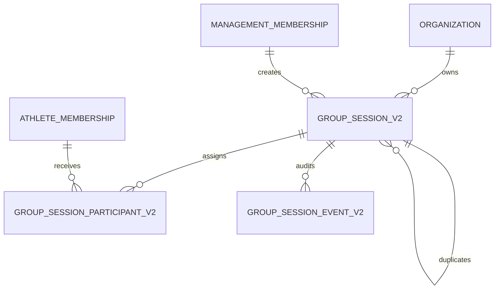

# Group Sessions V2 Architecture

## Scope

L09 introduces an inactive foundation for group sessions. It does not replace
`athlete_groups`, `athlete_group_members`, `calendar_workouts`,
`src/lib/api/groups.ts`, `src/lib/api/RroupCalendar.ts`, `QuickLibrary`, or
`DayView`. No existing screen imports the V2 modules and `groupsV2` remains
`false` by default.

The legacy feature schedules a group by inserting one `calendar_workouts` row
per athlete. It later infers the group operation from matching date, title,
category, and subcategory. This is not a durable business identity and makes
partial failure, deletion, duplication, history, and analytics fragile.

## Alternatives considered

| Model | Advantages | Limits | Decision |
| --- | --- | --- | --- |
| Continue per-athlete calendar copies | Reuses the visible legacy model. | No canonical identity; non-atomic multi-write; ambiguous deletion; duplicated content. | Rejected. |
| Add a group-session column to `calendar_workouts` | Smaller initial SQL diff. | Couples V2 to active legacy rows and policies; still stores the workout N times. | Rejected. |
| Canonical V2 session plus participant assignments | One source of workout truth, explicit lifecycle, audit, atomic RPCs, durable analytics surface. | Requires a future read/UI integration and L05 access provisioning. | Selected. |

## Bounded model

`public.group_sessions_v2` stores shared content once: date, title, workout
fields, blocks, lifecycle status, lineage and optimistic `version`.
`public.group_session_participants_v2` stores each athlete-membership
assignment independently. Removal is historical (`assignment_status =
'removed'`), and re-adding reactivates the same assignment identity. It never
creates a `calendar_workouts` copy. `public.group_session_events_v2` is an
append-only audit trail written by the RPCs.

The V2 uses L05 `access_control.organizations` and organization memberships,
not legacy group tables. This prevents a V1/V2 dependency. A future product
migration will need an explicit, reviewed mapping from legacy athlete records
to active access-control memberships before V2 can be exposed.

## Responsibilities

| Layer | Path | Responsibility | Must not do |
| --- | --- | --- | --- |
| Database guard | `groups_v2` schema | Authorization guards, integrity triggers, audit helper. | Expose direct client writes. |
| Transaction boundary | public `*_group_session_v2` RPCs | One atomic business operation per call. | Trust actor, role, participant, or version supplied by the client. |
| Repository | `src/services/groups-v2/repositories/` | Translate DTOs to one typed RPC. | Chain table writes or include business decisions. |
| Service | `src/services/groups-v2/` | Local DTO validation and stable error categories. | Import the legacy client or render UI. |
| Domain types | `src/types/groups/` | Explicit input, operation, and snapshot contracts. | Depend on React state. |

## Security and lifecycle

All V2 tables have RLS. `authenticated` has read-only table grants and can
write only through the seven `SECURITY DEFINER` RPCs. Every security-definer
function fixes `search_path`. An active management membership is required;
coaches must manage every active participant unless their organization role is
administrator or owner. Athlete access is derived from L05 relations. A public
feature flag never grants database access.

The lifecycle is `scheduled -> cancelled` or `scheduled/cancelled -> deleted`.
Deletion is logical, so participant assignments, audit events, statistics,
sync history, and later AI explanations remain attributable. The V2 does not
yet implement reactivation, per-athlete execution feedback, integrations, or
AI actions; those require separate product decisions.

## Performance and future use

The retained indexes serve organization schedule reads, participant timelines,
session participants, event history, and duplicate lineage. Shared blocks are
stored once, reducing write volume from O(participants) content copies to
O(1) content plus O(participants) lightweight assignments. The canonical ID,
version, status, lineage and audit timeline provide stable future anchors for
Garmin/Strava/Wahoo synchronization, load statistics and explainable AI.

## Compatibility and rollback

L09 has no runtime integration. The immediate rollback is disabling or keeping
`groupsV2` disabled; current users stay on legacy. A deployed corrective action
must be a new additive migration, never a destructive rollback. Do not delete
V2 records to stop a pilot. The legacy module can be removed only after an
approved migration, dual-read comparison, controlled pilot, evidence of
functional equivalence, and explicit business approval.
